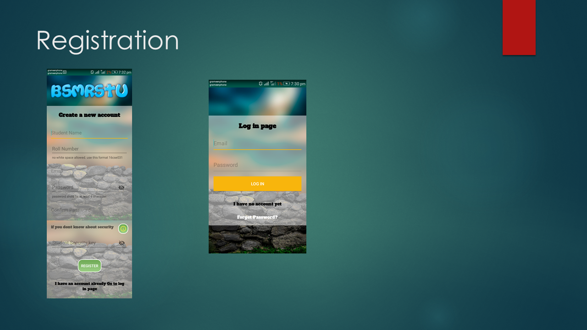
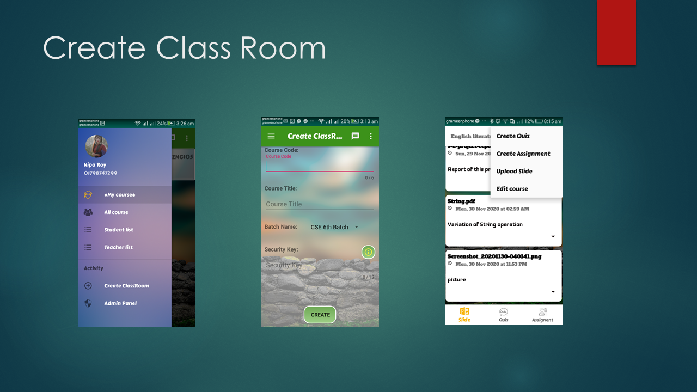
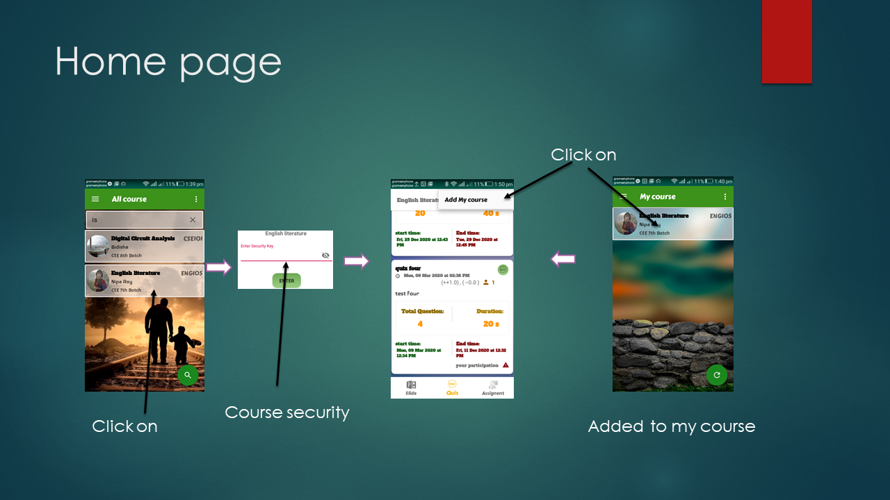
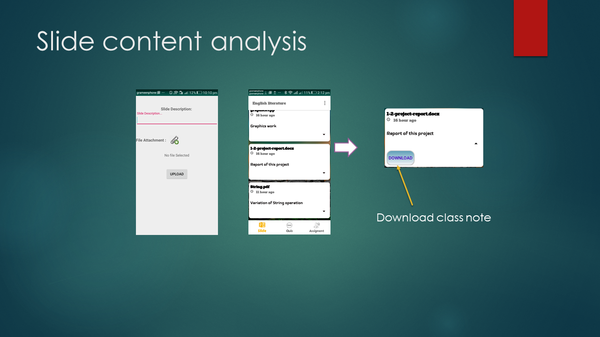
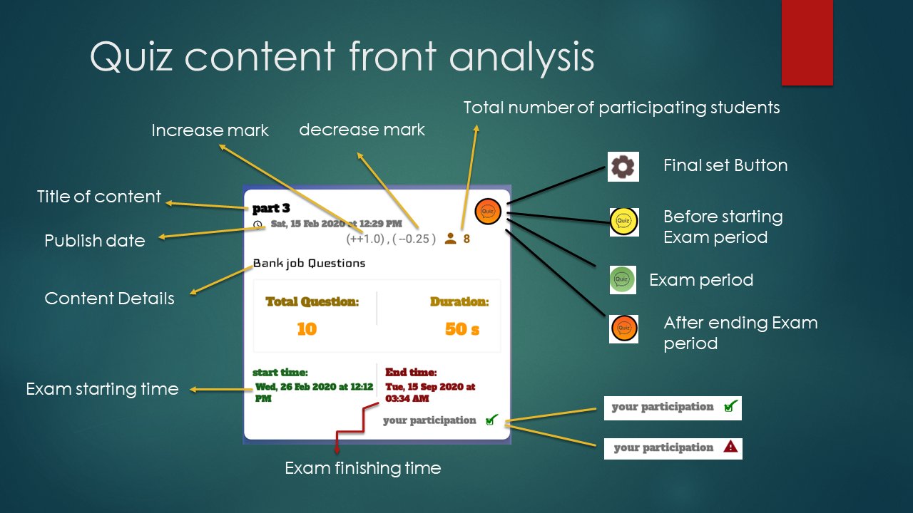
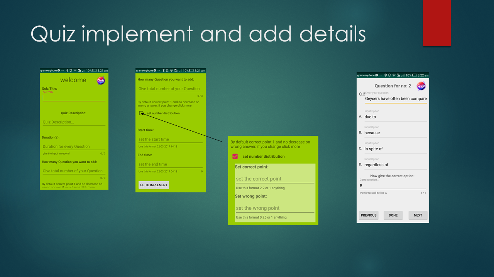
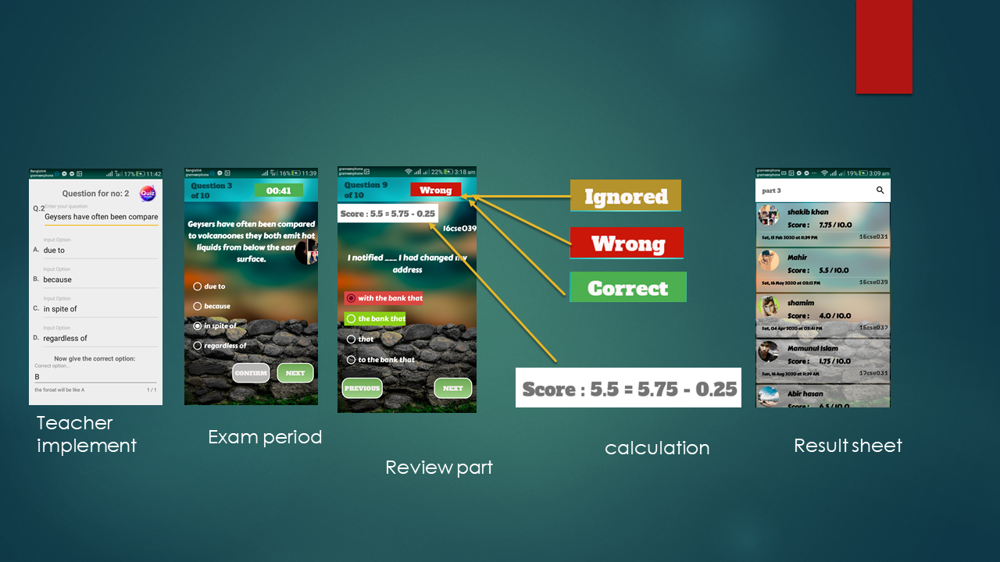
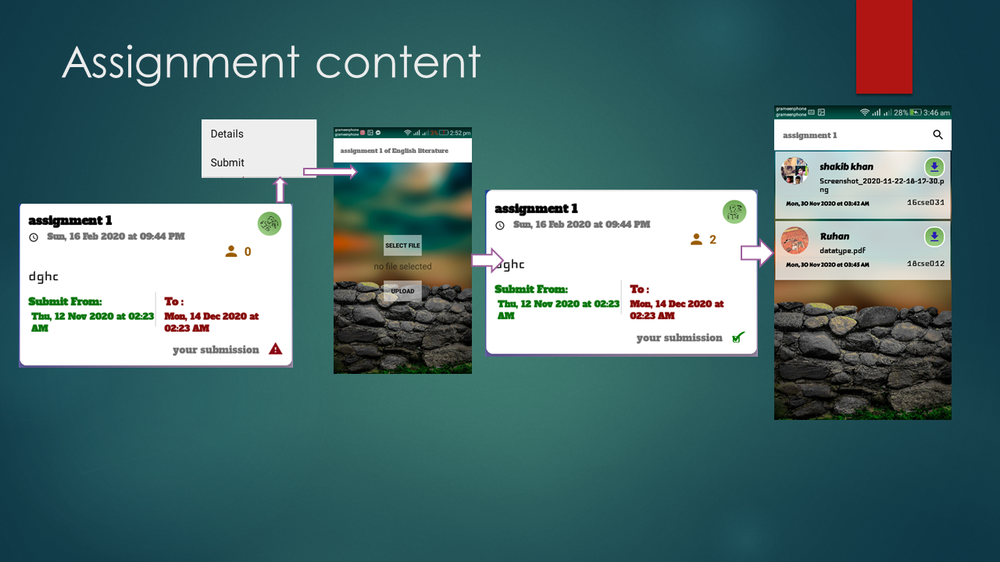
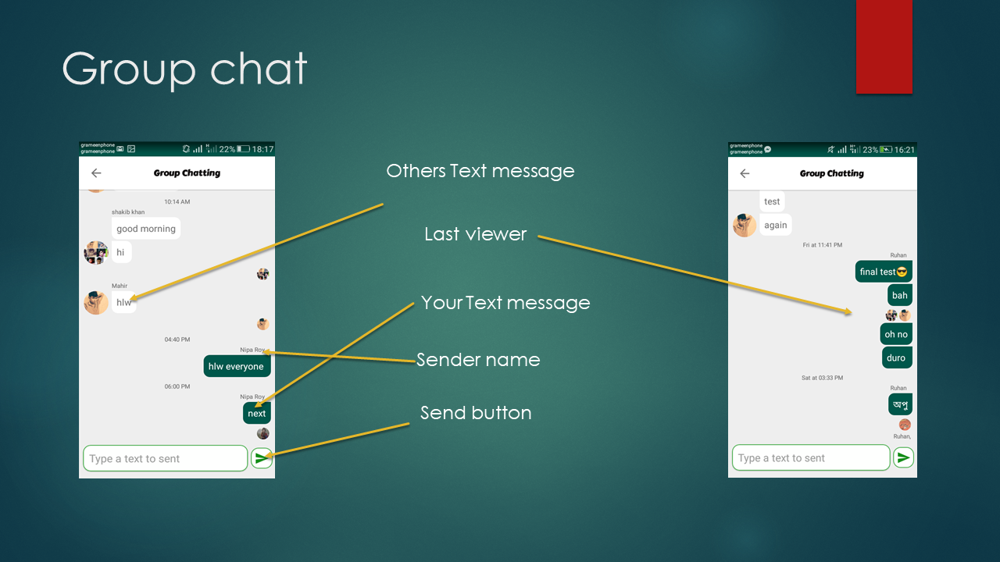

# Virtual Classroom App

### Presentation

You can view the PowerPoint presentation [here](https://raw.githubusercontent.com/shakibhoseen/virtual_class_room/master/PresentationVirtual.pptx).

### Image Slideshow

<!-- Slide 1 -->

<!-- Slide 2 -->

<!-- Slide 3 -->

<!-- Slide 1 -->

<!-- Slide 2 -->

<!-- Slide 3 -->

<!-- Slide 1 -->

<!-- Slide 2 -->

<!-- Slide 3 -->

<!-- Add more slides as needed -->

The Virtual Classroom App is a web-based education platform built on Firebase that offers a secure and interactive learning experience for both teachers and students.

## Features

### Authentication

- **Teacher Authentication:** Teachers can sign up and log in using their credentials.
- **Student Authentication:** Students can sign up and log in using their credentials.
- **Security Codes:** Both teachers and students need a security code to join the app, ensuring that only authorized users from the university can access the platform.

### Classroom Creation

- **Teacher-Created Classrooms:** Teachers can create and manage classrooms, providing details such as course code, title, and a unique classroom key.
- **Secure Access:** The classroom key ensures that only the intended students can join a particular class, maintaining security and privacy.

### Classroom Sections

1. **Slides:** Teachers can upload lecture notes, PDFs, and other educational materials for students to download and read.
2. **Quizzes:** Teachers can create quizzes with multiple-choice questions, set start times, and automatically publish results.
3. **Assignments:** Teachers can assign tasks with due dates, and students can upload their assignments until the deadline.

### My Courses

- **Students' Convenience:** Once students join a class, they don't need to re-enter the key; the app saves it under "My Courses" until the teacher changes the classroom key.

### Video Conferencing and Group Chat

- **Interactive Learning:** The app offers video conferencing for live classes, ensuring real-time interaction between teachers and students.
- **Group Chat:** Students can engage in group discussions and ask questions in a dedicated chat section.

## Usage

1. **Teacher Login:** Teachers log in with their credentials and create classrooms.
2. **Student Login:** Students log in with their credentials and join classrooms using the provided security codes.
3. **Classroom Interaction:** Teachers upload materials, create quizzes, assign tasks, and conduct live classes.
4. **Student Engagement:** Students access course materials, take quizzes, submit assignments, participate in live classes, and engage in group discussions.

## Security

- The security code system ensures that only authorized university members can access the app.
- Teachers can change the classroom key if needed, maintaining control over who enters their classes.

## Installation

1. Clone this repository to your local machine.
2. Configure Firebase for authentication and database functionalities.
3. Deploy the app to a hosting platform or server.

## Contributing

Contributions are welcome! Please follow our [Contribution Guidelines](CONTRIBUTING.md) to get started.

## License

This project is licensed under the [MIT License](LICENSE.md).

## Contact

For questions or support, please contact [Md shakib Hossain](mailto:shakibhossen100gmail.com).

---

Feel free to customize the README further to include specific installation instructions, development guidelines, or any other information relevant to your project. Additionally, you can create separate documentation files if needed for more detailed instructions on setup and usage.

